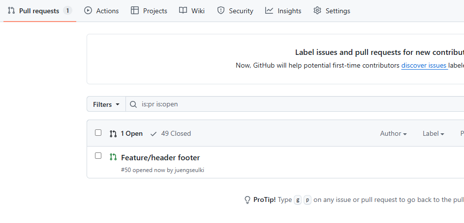
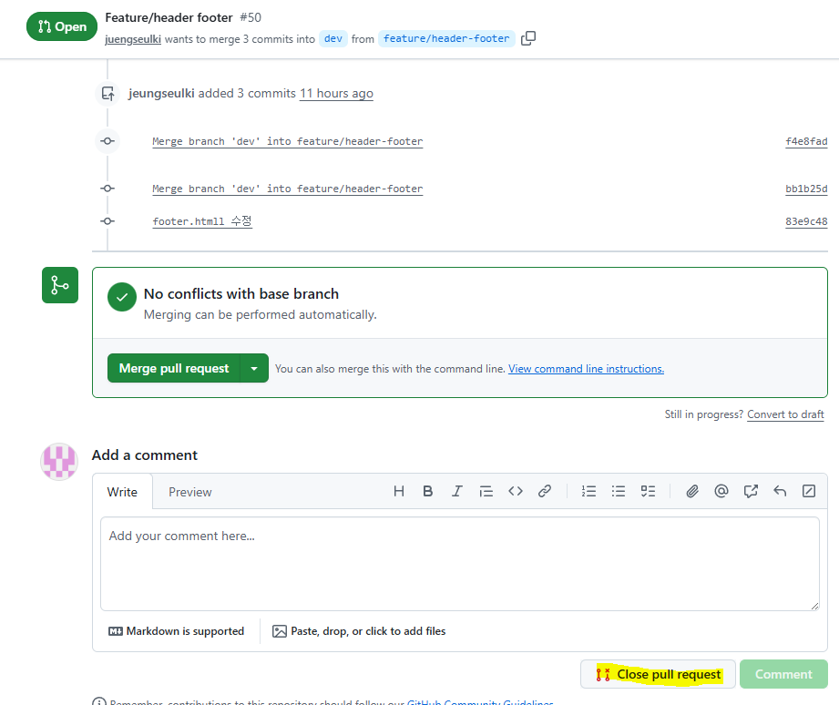
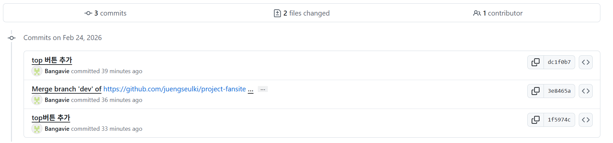
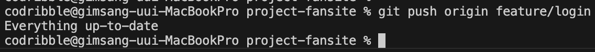

<h1 align="center">🎤 EPIK HIGH FAN SITE</h1>
<p align="center"><i>“우리는 아직 꿈을 꾼다.”</i></p>

<p align="center">
힙합과 문학의 경계를 허문 아티스트, 에픽하이를 위한 팬 아카이브 프로젝트.  
단순한 정적 웹사이트가 아닌, 감성과 구조를 함께 설계한 협업 기록입니다.
</p>

---

# 💌 PROJECT HERO

> 음악을 듣는 공간이 아니라,  
> **에픽하이의 밤을 함께 걷는 공간**을 만들고 싶었습니다.

HTML과 CSS만으로 브랜드 무드를 설계하고,  
Git과 GitHub 협업을 통해 하나의 무대를 완성했습니다.

---

# 📚 목차

1. [🌙 프로젝트 개요](#-프로젝트-개요)
2. [🎨 기획 의도](#-기획-의도)
3. [👥 팀원 및 역할](#-팀원-및-역할)
4. [🛠 기술 스택](#-기술-스택)
5. [🏗 아키텍처 & 폴더 구조](#-아키텍처--폴더-구조)
6. [📄 페이지별 상세 구현](#-페이지별-상세-구현)
7. [🔀 Git 협업 전략](#-git-협업-전략)
8. [🚨 트러블슈팅](#-트러블슈팅)
9. [✅ 팀 체크리스트](#-팀-체크리스트)
10. [🌌 프로젝트 회고 (팀 전체)](#-프로젝트-회고-팀-전체)
11. [🖤 개인 회고](#-개인-회고)

---

# 🌙 프로젝트 개요

- **Project Name** : EPIK HIGH | 각자의 밤
- **Type** : Team Mini Project
- **Stack** : HTML / CSS / Git / GitHub
- **Goal**
  - 시맨틱 구조 기반 웹사이트 설계
  - Git Flow 기반 협업 경험
  - 충돌 해결 및 PR 중심 개발 경험

---

# 🎨 기획 의도

에픽하이 특유의 감성, 밤, 공연, 네온, 그리고 힙합 무드를  
웹으로 표현하는 것이 목표였습니다.

- 블랙 & 그레이 베이스
- 레드 포인트 컬러
- 공연장 같은 깊이감 있는 UI
- 정보 나열이 아닌 **스토리 흐름 중심 구조**

HERO → 음악 → 앨범 → 소식 → 참여 → 메시지  
팬의 동선을 고려한 구조로 설계했습니다.

---

# 👥 팀원 및 역할

| 이름            | 담당 페이지           |
| --------------- | --------------------- |
| 👩👑 **정슬기** | index, header, footer |
| 👨 **심현수**   | Community, Fan Letter |
| 👨 **김상우**   | Login, Sign           |
| 👨 **강정민**   | Gallery               |
| 👩 **신영미**   | Discography           |
| 👨 **이진한**   | Schedule              |
| 👩 **정다희**   | About                 |

---

# 🛠 기술 스택

- HTML5 (Semantic Markup)
- CSS3 (Flexbox, Grid, Animation)
- Git
- GitHub

※ JavaScript는 사용하지 않았습니다.

---

# 📑 아키텍처 & 폴더 구조

```
project-fansite/
│
├── index.html
├── README.md
│
├── feature/
│    ├── header.html
│    ├── footer.html
│    ├── about.html
│    ├── gallery.html
│    ├── schedule.html
│    ├── discography.html
│    ├── community.html
│    ├── community-writing.html
│    ├── fan-letter.html
│    ├── login.html
│    ├── sign.html
│    │
│    ├── comunity-sub
│    │    └── sub1~6.html
│    │
│    └── discography-sub
│         ├── 99.html
│         ├── 신발장.html
│         ├── e.html
│         ├── epikhigh.html
│         ├── epikhigh-sang.html
│         ├── HighSociety.html
│         ├── Mapofthe.html
│         ├── Pieces.html
│         ├── Remapping.html
│         ├── SwanSongs.html
│         └── wevedone.html
│
├── css/
│   ├── header.css
│   ├── footer.css
│   └── 각 페이지 css
│
│
└── images/ 각 페이지 이미지
     ├── about/
     ├── gallery/
     ├── schedule/
     ├── discography/
     ├── community/
     ├── fan-letter/
     ├── login/
     └── sign/

```

---

# 📄 페이지별 상세 구현

## 👩👑 정슬기 (팀장) — index / header / footer

### ✅ 개인 체크리스트

- [✅] HTML 마크업 완성
- [✅] 시맨틱 태그 사용
- [✅] 공통 네비게이션/푸터 포함
- [✅] CSS 스타일링 완성
- [✅] 커밋 컨벤션 준수
- [✅] feature 브랜치 작업 후 PR 생성

### 🧱 HTML 구조 설정

**1️⃣ Header / Footer**

- `<header>`, `<nav>`, `<footer>` 시맨틱 태그 사용
- `.inner` 컨테이너 구조로 중앙 정렬
- `<ul><li><a>` 네비게이션 구조 통일
- footer 3단 구성 (좌 / 중앙 / 우 영역 분리)
- SNS 외부 링크 `target="_blank"` + `rel="noopener noreferrer"` 적용
- 배경 타이포 **"THANK YOU 1TEAM"** 절대 위치 레이어 구성

---

**2️⃣ index 페이지**

- `<main>`, `<section>` 기반 구조 설계
- HERO → ARTIST → DISCOGRAPHY → NEWS → NEWSLETTER → CARD → QUOTE 흐름 구성
- 슬라이더 구조 통일 (`slider → track → item`)
- header / footer 공통 파일 구조 분리

### 🎨 CSS 스타일

- `position: fixed` 고정 헤더 + `body` padding 보정
- 블랙 & 레드 포인트 컬러 구성
- 글래스모피즘 (`rgba`, `backdrop-filter`)
- hover underline 애니메이션
- fade-up / fade-in / fade-zoom 효과 적용
- 무한 슬라이드 `@keyframes` 구현
- grayscale → 컬러 전환 효과
- watermark 레이어 처리
- `scroll-behavior: smooth`
- 상단 이동 버튼 `position: fixed` 배치

---

## 👨 심현수 — Community / Fan Letter

### ✅ 개인 체크리스트

- [✅] HTML 마크업 완성
- [✅] 시맨틱 태그 사용
- [✅] 공통 네비게이션/푸터 포함
- [✅] CSS 스타일링 완성
- [✅] 커밋 컨벤션 준수
- [✅] PR 생성

### 🧱 HTML 구조 설정

- `<table>` 게시판 구조
- community_sub 1~6 분리
- `<iframe>` / `` 삽입
- `<form>` 구성

### 🎨 CSS 스타일

- text-shadow
- nth-child 열 너비 조정
- 폼 UI 정렬

---

## 👨 김상우 — Login / Sign

### ✅ 개인 체크리스트

- [✅] HTML 마크업 완성
- [✅] 시맨틱 태그 사용
- [✅] 공통 네비게이션/푸터 포함
- [✅] CSS 스타일링 완성
- [✅] 커밋 컨벤션 준수
- [✅] PR 생성

### 🧱 HTML 구조 설정

- `<form>` 구조
- `<label>` + `<input>` 연결
- `<a>` 버튼 이동 처리

### 🎨 CSS 스타일

- 중앙 정렬
- border 기반 focus 처리

---

## 👨 강정민 — Gallery

### ✅ 개인 체크리스트

- [✅] HTML 마크업 완성
- [✅] 시맨틱 태그 사용
- [✅] 공통 네비게이션/푸터 포함
- [✅] CSS 스타일링 완성
- [✅] 커밋 컨벤션 준수
- [✅] PR 생성

### 🧱 HTML 구조 설정

- `<section>`, `<article>` 구조
- 카드 반복 구조

### 🎨 CSS 스타일

- Grid auto-fit
- hover scale
- 반응형 처리

---

## 👩 신영미 — Discography

### ✅ 개인 체크리스트

- [✅] HTML 마크업 완성
- [✅] 시맨틱 태그 사용
- [✅] 공통 네비게이션/푸터 포함
- [✅] CSS 스타일링 완성
- [✅] 커밋 컨벤션 준수
- [✅] PR 생성

### 🧱 HTML 구조 설정

- CD 버튼 구조
- `<ol>` 트랙리스트

### 🎨 CSS 스타일

- hover scale
- 단위 통일
- header 충돌 수정

---

## 👨 이진한 — Schedule

### ✅ 개인 체크리스트

- [✅] HTML 마크업 완성
- [✅] 시맨틱 태그 사용
- [✅] 공통 네비게이션/푸터 포함
- [✅] CSS 스타일링 완성
- [✅] 커밋 컨벤션 준수
- [✅] PR 생성

### 🧱 HTML 구조 설정

- 공연 일정 `<table>`

### 🎨 CSS 스타일

- 글래스모피즘 테이블
- hover 행 강조

---

## 👩 정다희 — About

### ✅ 개인 체크리스트

- [✅] HTML 마크업 완성
- [✅] 시맨틱 태그 사용
- [✅] 공통 네비게이션/푸터 포함
- [✅] CSS 스타일링 완성
- [✅] 커밋 컨벤션 준수
- [✅] PR 생성

### 🧱 HTML 구조 설정

- 멤버 정보 섹션 분리
- 수상경력 `<table>`

### 🎨 CSS 스타일

- flex 정렬
- 테이블 border 정리

---

# 🔀 Git 협업 전략

- Git Flow 전략 사용  
  `main → dev → feature/페이지명`

- 모든 작업은 feature 브랜치에서 진행
- Pull Request를 통해 dev 병합
- merge 전 PR 확인 후 진행
- main 브랜치는 최종 배포용 유지

---

# 🚨 트러블슈팅

## 1️⃣ 잘못 올린 PR 닫는 법

### 문제



Branch에서 잘못올린 Pull Request 생성

### 해결



- GitHub → 해당 PR 접속
- 하단 `Close Pull Request` 클릭
- 필요 시 올바른 브랜치에서 새 PR 생성

---

## 2️⃣ 여러 번 commit & push 후 삭제하는 법

### 문제



이미 여러 번 push한 커밋을 되돌려야 하는 상황

### 해결 방법

#### ✔ 특정 커밋으로 되돌리기

```
git reset --hard 커밋해시
git push origin 브랜치명 --force
```

※ 협업 중일 경우 반드시 팀원과 공유 후 진행

---

## 3️⃣ 수정 → add → commit → pull → merge 완료

### 그런데 push가 안 되는 문제



### 원인

merge 커밋 이후 원격 저장소와 로컬 상태가 똑같음
수정을 진행한 부분이 log에는 남아있지만 동기화됨

### 해결

:

```
git fetch origin
```

브랜치를 add . / commit 전으로 돌리기 :

```
git reset --hard origin/브랜치이름
```

---

# ✅ 팀 체크리스트

- [✅] 모든 페이지 간 링크가 정상 작동하는가?
- [✅] 공통 헤더/푸터가 모든 페이지에서 동일한가?
- [✅] **HTML 필수 요소**가 팀 전체에서 모두 사용되었는가?
  - [✅] `<a>`
  - [✅] `<h1>~<h6>`, `<p>`
  - [✅] `<ul>`, `<ol>`
  - [✅] `<table>`
  - [✅] `` / `<video>` / `<audio>` / `<iframe>`
  - [✅] `<form>`, `<input>`
  - [✅] 시맨틱 태그
- [✅] **CSS 필수 요소**
  - [✅] Box Model
  - [✅] Display
  - [✅] Selector
  - [✅] Flexbox
  - [✅] position: fixed
  - [✅] position: sticky
- [✅] Git Flow 구조 준수
- [✅] 모든 병합 PR 사용
- [✅] README 작성 완료

---

# 🌌 프로젝트 회고 (팀 전체)

이번 프로젝트를 통해 단순히 웹페이지를 만드는 것을 넘어,  
협업이라는 과정 자체를 경험할 수 있었습니다.

초반에는 Git 충돌과 push 오류로 인해 작업이 멈추는 상황도 있었지만,  
문제를 직접 해결하면서 협업의 흐름을 이해하게 되었습니다.

기능 구현보다 더 중요했던 것은  
서로의 코드를 이해하고 조율하는 과정이었습니다.

---

# 🖤 개인 회고

## 👑 정슬기 (팀장)

공통 레이아웃과 공통 CSS를 직접 정리하면서 프로젝트의 전체 구조를 먼저 설계했습니다.
스타일을 단순히 적용하는 것이 아니라, 재사용성과 확장성을 고려해 클래스를 구성해야 한다는 점을 배우게 되었습니다.
공통 CSS를 설계하는 과정에서 구조가 명확해야 이후 작업이 안정적으로 이어진다는 것을 체감했습니다.

특히 index 페이지를 구현하면서 레이아웃 구성과 UI 흐름을 집중적으로 고민했습니다.
Flex 정렬, 간격 조정, 섹션 간 균형을 반복적으로 수정하며 화면의 완성도를 높이기 위해 노력했습니다.
그 과정에서 CSS를 단순히 꾸미는 도구가 아니라 구조를 설계하는 언어로 이해하게 되었습니다.

초기에 작성해 두었던 아키텍처 스케치가 실제 구현 과정에서 큰 도움이 되었고, 설계 단계의 중요성을 명확히 느꼈습니다.

Git을 활용한 협업 과정에서는 단순한 작업 분담을 넘어, PR을 하나하나 확인하고 merge하면서 자연스럽게 PM의 역할도 경험할 수 있었습니다.
팀원들의 작업을 검토하며 코드 흐름을 이해하려 노력했고, 그 과정에서 다른 사람의 코드를 읽는 능력 또한 중요하다는 것을 알게 되었습니다.
팀원 한 분 한 분과 충분히 대화하며 방향을 맞춰가는 과정 속에서 협업의 의미를 다시 한 번 깨닫게 되었습니다.

마지막으로 끝까지 함께해 준 팀원분들께 진심으로 감사드립니다.
요구가 많았던 팀장이었지만 묵묵히 따라와 준 덕분에 프로젝트를 잘 마무리할 수 있었습니다.
이번 경험은 단순히 기능을 구현하는 것을 넘어, 구조를 설계하고 공통 스타일을 관리하며 협업을 이끄는 과정까지 경험해본 시간이었습니다.
기술적인 성장과 함께, 개발을 어떤 관점으로 바라봐야 하는지 고민하게 된 소중한 프로젝트였습니다.

## 👨 심현수

프로젝트 진행 중 Git과 관련해 여러 실수가 있었습니다.
브랜치명 컨벤션을 잘못 작성한다거나, push를 하지 않은 상태에서 PR을 시도하는 등의 실수가 있었습니다.
git push origin 브랜치명을 입력해야 하는 상황에서 단순히 push만 하고 왜 동작하지 않는지 당황하기도 했습니다.
금요일에 정리했던 내용도 주말이 지나니 금방 잊어버린 부분이 많았습니다.

작업 도중 내용을 임시로 저장하기 위해 사용했던 git stash와 git stash pop,
브랜치를 잘못 올려 원격에서 삭제해야 했을 때 사용했던 git push origin --delete 브랜치명 등을 새롭게 배우게 되었습니다.
이번 기회를 통해 Git을 실제로 많이 사용해볼 수 있었고, 팀원들과의 소통도 활발하게 이루어져 의미 있는 시간이었습니다.

CSS의 경우 BEM 방식을 시도해보았지만, 아직 완전히 이해하지 못한 상태에서 사용하다 보니 \_\_와 -- 요소 구분이 다소 모호하게 작성된 부분이 있었던 것 같습니다.

## 👨 김상우

그동안 Git을 백업 용도로만 사용해왔기 때문에 다른 작업자와 충돌이 발생할 일이 거의 없었습니다.
작업하고 올리고, 다시 작업하고 올리는 과정을 반복하는 방식이었습니다.
하지만 이번 미니 프로젝트를 통해 협업을 경험하며 브랜치를 제대로 활용하다 보니, 한 번 꼬이면 큰 문제가 생길 것 같다는 긴장감이 들었습니다.

다행히 큰 이슈 없이 마무리할 수 있었지만, 이 과정을 통해 작업자 간의 의사소통이 얼마나 중요한지 느낄 수 있었습니다.
이번 경험을 계기로 브랜치에서 작업할 경우, 작업을 시작하기 전과 PR을 보내기 전에는 항상 git pull origin dev를 실행하는 루틴을 습관처럼 만들고 싶습니다.

## 👨 강정민

이전 프로젝트보다 규모가 큰 작업이었기 때문에 협업의 중요성을 더욱 깊이 느낄 수 있었습니다.
각자 담당 페이지를 맡아 작업했지만, 하나의 프로젝트 안에서 서로의 작업이 영향을 주고받는다는 점에서 항상 신중하게 접근해야 했습니다.

특히 Git Flow를 연습하는 과정에서 작은 실수도 팀원들에게 영향을 줄 수 있다는 점이 부담으로 다가오기도 했지만, 동시에 협업 과정에서의 책임감을 배우는 계기가 되었습니다.
팀원들과 지속적으로 피드백을 주고받으며 부족한 부분을 보완할 수 있었고, 개인적으로도 개발 역량과 협업 능력을 함께 성장시킬 수 있었던 뜻깊은 시간이었습니다.
앞으로도 이러한 프로젝트 경험을 통해 실무에 가까운 협업 환경을 더 많이 경험해보고 싶습니다.

## 👩 신영미

프로젝트 초반에는 GitHub에서 여러 브랜치를 다루는 이론을 반복해 숙지했지만, 실제로 여러 명이 동시에 작업하는 상황에서는 어느 시점에 PR과 Pull을 진행해야 하는지 많이 헷갈렸습니다.
하지만 프로젝트를 진행하며 팀원들, 특히 팀장님의 도움을 통해 GitHub를 활용한 동시 작업에 점차 익숙해졌다고 느꼈습니다.

초반 구조를 설계할 때 시맨틱 태그를 활용해 공통 코드가 들어갈 header와 footer를 main과 분리해두었기 때문에, merge 이후에도 문제 없이 header와 footer가 적용되었습니다.
이를 통해 잘 구성된 HTML 마크업의 중요성을 다시 한 번 느낄 수 있었습니다.

이번 프로젝트를 통해 실습의 중요성과 좋은 동료들의 힘을 체감했으며, 개발자의 꿈에 한 발짝 더 가까워졌다는 생각에 기쁨을 느꼈습니다.

## 👨 이진한

이번 프로젝트 역시 팀원들에게 많은 것을 배우며 진행했습니다.
코드 작성도 쉽지 않았지만, Git 환경에서 브랜치를 제대로 변경하지 않은 채 push를 하여 PR이 불가능해지는 상황을 겪는 등 여러 어려움이 있었습니다.
하지만 다른 팀원분들의 도움으로 문제를 해결할 수 있었습니다.

이번 프로젝트는 개인의 코딩 역량을 평가하기보다는 팀원 간 협동을 다지는 데 더 큰 의미가 있다고 느꼈습니다.
뛰어난 개인이 모든 것을 이끌어 갈 수는 있겠지만, 각 페이지를 나누어 맡는 구조 속에서는 한 사람이 모든 것을 끌고 갈 수 없다는 점을 체감했습니다.
실력이 부족한 사람도 더 잘하는 팀원들에게 질문하며 배우고, 수많은 수정과 PR 과정을 거치면서 협동심을 기르는 프로젝트였다고 생각합니다.

1팀의 팀장님은 개인 역량도 뛰어나셨지만, 뒤처지는 사람도 함께 나아갈 수 있도록 이끌어 주는 리더십과 전체 프로젝트를 아우르는 능력을 가진 분이셨습니다.
부트캠프에 참가하기 전에는 코딩 실력을 늘려야 한다는 생각뿐이었지만, 이번 프로젝트를 통해 개인의 실력은 전제 조건일 뿐 전부가 될 수는 없다는 것을 깨달았습니다.
개발자란 무엇인지, 어떻게 일해야 하는지 고민해보게 된 계기였습니다.
함께해 준 팀원분들과 앞장서 고생해주신 팀장님께 감사드립니다.

## 👩 정다희

한 페이지를 온전히 담당해 작성하는 것이 어려울 것 같아 걱정이 많았습니다.
HTML은 작성할 수 있었지만 CSS를 구현하는 부분이 특히 부담이 되었습니다.
이미지에 gap을 주는 것과 배경색을 설정하는 부분에서 어려움을 겪었는데, 팀원분들의 도움으로 해결할 수 있었습니다.

부족한 부분이 있었지만 팀원분들과 팀장님의 도움 덕분에 페이지를 완성할 수 있었습니다.
또한 GitHub를 혼자 사용할 때와 달리 팀원들과 함께 사용하는 과정에서 충돌이 발생하지 않을까 걱정이 되었지만,
소통을 통해 PR을 진행하면서 큰 충돌 없이 마무리할 수 있었습니다.
이번 팀 프로젝트를 통해 GitHub 사용에 훨씬 익숙해질 수 있었습니다.

---

<p align="center">
  우리는 페이지를 만든 것이 아니라,  
  하나의 무대를 완성했습니다.
</p>
